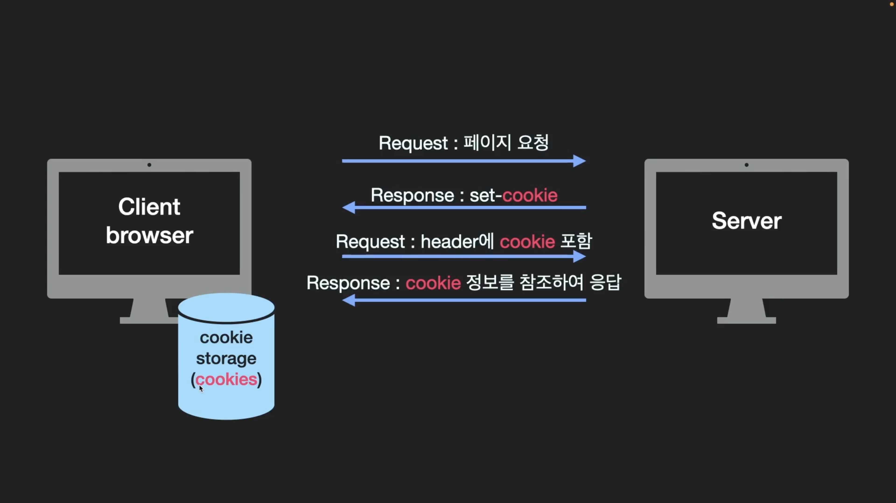

# Differences Between Cookie & Session
- 저장 위치의 차이에 따른 보안성, 부하

## 🍎 쿠키와 세션을 사용하는 이유
- HTTP는 다음과 같은 특징을 가진다.
    - Connectionless(비연결성)
    - Stateless(비상태성)
- 클라이언트가 HTTP request를 보냈을때 그에 맞는 HTTP response를 보낸 후 **연결을 끊고**, 서버는 클라이언트에 대한 상태 정보를 유지하지 않기 때문에 알 수 없게 된다.
    - **TIP : request header에 keep-alive 값을 통해 connection을 끝내지 않고 유지할 수 있다.**
- 만약 쿠키와 세션을 사용하지 않는다면 웹사이트에 로그인을 했음에도 페이지를 이동할 때마다 계속 로그인을 해야한다. 
- 또는 로그인을 할때, 아이디 비밀번호 저장을 하여 다음번에 재방문 할 때에도 해당 아이디와 비밀번호를 자동으로 입력하도록 할 수 있다.
- 또, 쇼핑몰의 장바구니 기능과 팝업에서 "오늘 더이상 이 창을 보지 않음"등의 편의성을 제공할 수 있게 된다.

## 🍎 쿠키
- 쿠키의 생성과 저장은 구현에 따라 다르지만 원리는 동일하다.
    - 1. 서버가 클라이언트로부터 요청을 받았을 때, 클라이언트에 관한 정보를 토대로 쿠키를 구성한다.
    - 2. 서버는 클라이언트에게 보내는 응답의 header에 쿠키를 담아 보낸다.
    - 3. 클라이언트가 응답을 받으면, 브라우저는 쿠키를 쿠키 디렉터리에 저장한다.
- 쿠키는 클라이언트(브라우저)에서 key-value쌍으로 로컬에 저장되는 데이터 파일.
    - 유효시간 내에서는 브라우저가 종료되어도 계속 유지된다.
- 서버에서 response header에 set-cookie 속성을 사용해서 클라이언트에 쿠키를 만들고, 사용자가 따로 작업을 하지 않아도 브라우저가 쿠키를 request header에 담아서 서버에 전송한다.

### 📖 쿠키를 이용한 요청 / 응답 과정
- 1. 클라이언트(브라우저)에서 서버에 페이지를 요청한다.
- 2. 서버는 클라이언트가 보낸 요청에 대한 응답을 해주면서 해당 클라이언트의 정보들을 담은 쿠키를 set-cookie를 통해서 같이 전달한다.
- 3. 브라우저의 쿠키 스토리지에 쿠키들이 담기게 된다.
- 4. 이후에 클라이언트가 request를 할 때마다 header에 cookie를 포함해 전달한다.
- 5. 서버는 쿠키가 포함되어있는 request를 받고 "아! 광고창을 안 본다고 했었구나", "OK 이번에 응답할 때 광고창 안보내줄게!"라고 쿠키 정보를 참조하여 클라이언트에 응답한다.

## 🍎 세션
- 세션은 기본적으로 쿠키를 이용하여 구현.
- 클라이언트를 구분하기 위해 각 클라이언트에게 session ID를 부여하고 클라이언트는 쿠키에 session ID를 저장해둔다.
- **사용자 정보를 브라우저에 저장하는 쿠키와 달리 세션은 서버측에 저장하고 관리한다.**
- 세션은 유효시간을 두어 일정 시간 응답이 없다면 끊을 수 있고, 브라우저가 종료될 때까지 인증상태를 유지할 수 있다.
- 사용자 정보를 서버에 두기 때문에 쿠키보다 보안은 좋지만 서버 자원을 차지하기 때문에 서버에 과부하를 줄 수 있고 성능 저하의 요인이 될 수 있다.

### 📖 세션을 이용한 요청 / 응답 과정
- 1. 클라이언트(브라우저)가 페이지 요청을 했을때 서버는 응답을 하면서 쿠키에 session ID를 담아 보낸다.
- 2. 클라이언트는 응답으로 온 session ID를 쿠키 스토리지에 넣어두고 다음에 서버에 요청을 보낼때 request header 쿠키에 session ID를 담아 보낸다. 쿠키 정보가 아닌 session ID만 보내니까 보안 측면에서 좋다.
- 3. 서버는 클라이언트가 보낸 request를 받고 session ID를 서버의 DB에서 찾아 클라이언트에게 응답한다.

## 🍎 세션과 쿠키의 차이점
- 쿠키
    - 클라이언트(브라우저 or 로컬)에 key - value 쌍으로 저장되는 데이터 파일
    - 유효시간 내에서는 브라우저가 종료되어도 계속 유지된다.
- 세션
    - 서버에 데이터를 저장하므로 서버 용량이 허용하는 한에서 제한 없이 데이터를 저장할 수 있는 장점
    - 세션은 브라우저가 종료되면 삭제. or 서버에서 해당 세션을 삭제할 수 있기 때문에 쿠키보다 보안성이 좋다.

## 🍎 질문
- 세션이 보안도 좋은데 쿠키를 사용하는 이유?
    - 세션은 서버의 자원을 사용하기 때문에 서버가 느려질 수 있고 서버 자원이 부족할 수 있다.
    - 따라서 쿠키를 사용하면 서버 자원의 낭비를 방지하여 웹사이트 속도를 높일 수 있다.
- 쿠키의 사용 예
    - 쇼핑몰의 장바구니 기능
    - 로그인시 아이디와 비밀번호 저장
    - "오늘 더이상 이 창을 보지 않음"
