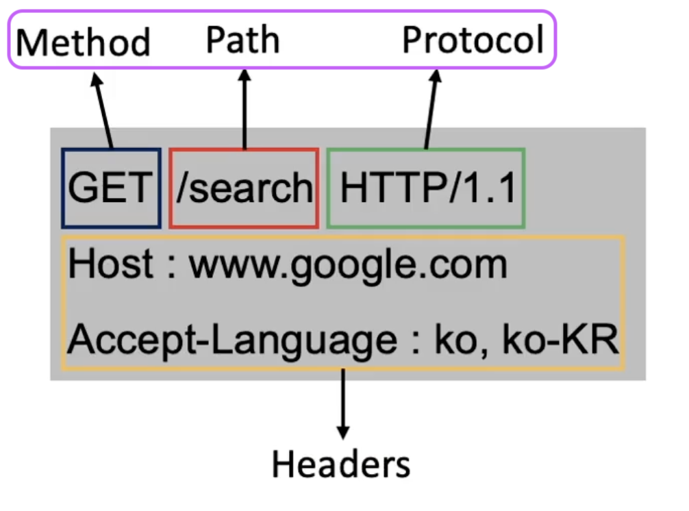
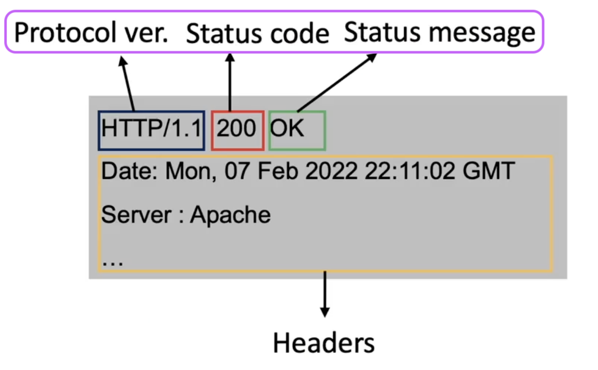

# HTTP란?
## 🍎 정의
- HTTP는 HyperText Transfer Protocol의 약자로 서버 - 클라이언트 모델을 따르면서 request, response 구조로 웹 상에서 정보를 주고받을 수 있는 프로토콜
- HTTP의 가장 큰 특징은 **Connectionless**와 **Stateless**

## 🍎 HTTP을 더 자세히 알아보자
### 📖 그래서 HTTP가 정확히 무엇인가?
- **한마디로 웹 상에서 정보를 전송하기 위한 통신 프로토콜로써 HTML과 같은 문서를 전송하는 것에 사용.**
- 클라이언트가 HTTP request를 서버에 보내면 서버는 HTTP response를 클라이언트에 보내는 방법으로 클라이언트와 서버가 통신한다.
### 📖 HTTP Request의 구조

- HTTP request는 아래와 같이 이루어져있다.
    - start line
        - start line은 아래와 같이 이루어져 있다.
        - method
        - path
        - HTTP version
    - headers
    - body

### 📖 HTTP Response의 구조

- HTTP response는 아래와 같이 이루어져있다.
    - status line
        - status line은 아래와 같이 이루어져 있다.
        - HTTP version
        - status ocde
        - status message
    - headers
    - body

### 📖 Connectionless / Stateless
- HTTP는 서버에 연결 후 요청에 응답을 받으면 연결을 끊어버리는 Connectionless 특성을 갖는다.
    - 이로 인해 많은 사람이 웹을 이용하더라도 실제 동시 접속을 최소화하여 더 많은 유저의 요청을 처리할 수 있다.
- 하지만 연결을 끊었기 때문에, 클라이언트의 이전 상태(로그인 유무 등)를 알 수가 없다는 Stateless 특성이 생긴다.
- 정보를 유지할 수 없는 Connectionless, Stateless 특성을 가진 HTTP의 단점을 해결하기 위해 cookie, session, jwt등이 도입되었다.

## 🍎 HTTP에 암호화를 추가한 HTTPS
- HTTP는 정보를 text 형식으로 주고받기 때문에 중간에 인터셉트할 경우 데이터 유출이 발생할 수 있는 문제가 있어, **HTTP에 암호화를 추가한 프로토콜이 바로 HTTPS**.
