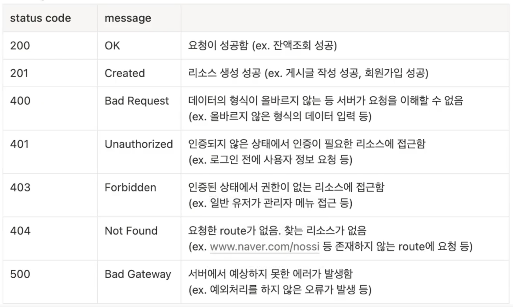

# HTTP Status Code

## 🍎 Status Code
- 웹 개발시 서버와 클라이언트가 HTTP 통신할 때 주고 받아야 할 값중 하나.
- 클라이언트로 부터 받은 request에 대한 서버의 response에 대한 간략한 설명.
- 상황에 알맞는 status code를 response에 담아서 클라이언트에 넘겨주면 이를 토대로 클라이언트는 알맞는 대응을 할 수 있다.

## 🍎 5개의 HTTP status code 클래스
- 1xx (정보)
    - 요청을 받았으며 작업을 계속한다.
- 2xx (성공)
    - 클라이언트가 요청한 동작을 성공적으로 수신하여 이해했고 성공적으로 처리하였다.
- 3xx (리다이렉션)
    - 요청을 완료하기 위해 추가 작업 조치가 필요하다.
- 4xx (클라이언트 오류)
    - 클라이언트의 요청에 문제가 있다.
- 5xx (서버 오류)
    - 서버가 유효한 요청의 수행을 실패했다.

## 🍎 자주 등장하는 HTTP 응답 코드
- 200 (주로 GET 요청이 성공 했을때)
- 201 (주로 POST 요청이 성공 했을때)

