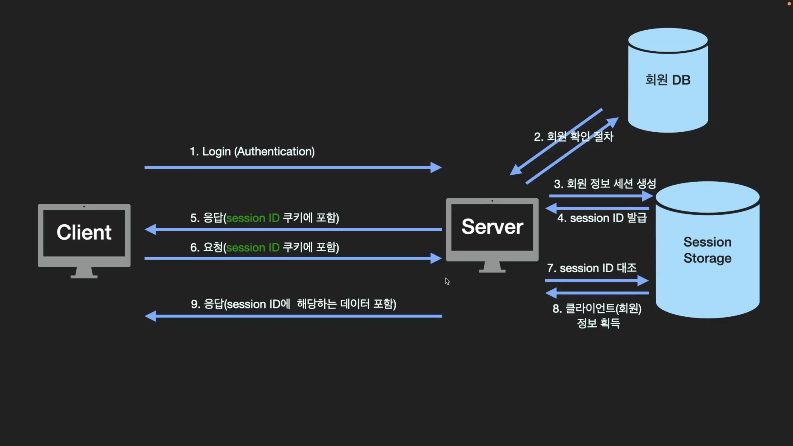

# Login Process With Cookie And Session

## 🍎 쿠키와 세션을 통한 인증과 인가
- 인증(authentication)
    - 사용자가 누구인지 확인하는 절차
    - 회원가입과 로그인 과정이 대표적 예시
- 인가(authorization)
    - 사용자가 요청하는 것에 대한 권한이 있는지 확인하는 절차

### 📖 세션을 통한 인증, 인가의 절차
- 1. 클라이언트가 로그인을 하면 서버는 회원정보를 대조하여 **인증**한다.(authentication)
- 2. **회원 정보(클라이언트 정보)를 세션 저장소에 생성하고 session ID를 발급한다.**
- 3. 클라이언트로 보낼 HTTP response header 쿠키에 session ID를 담아 보낸다.
- 4. 클라이언트에서는 서버에서 보낸 session ID를 쿠키 저장소에 저장하고 이후에 HTTP request를 보낼 때마다 쿠키에 session ID를 담아서 보낸다.
- 5. 서버에서는 쿠키에 담겨온 session ID에 해당하는 회원 정보를 세션 저장소에서 가져온다.(authorization)
- 6. 응답 메시지에 회원 정보를 바탕으로 처리된 데이터를 담아서 클라이언트에게 보낸다.

### 📖 세션과 쿠키를 이용한 로그인 방식의 단점
- session ID만 쿠키에 담겨서 요청을 보내기 때문에 요청 때마다 사용자 정보를 쿠키에 담아서 전송하는 것보다 안전하다. 하지만 session ID만 노출되어 악의를 가진 다른 사용자가 이를 이용해 서버에 요청하면 **서버는 구별해낼 수 있는 방법이 없다.**
- 이것을 Session hijacking이라고 한다.
- 해결책으로는 HTTPS를 사용하거나 session에 짧은 주기로 만료시간을 설정하는 방법이 있다.
- 또, 세션과 쿠키를 이용한 로그인 방식은 Load Balancing 및 서버 효율성 관리 및 확장이 어려워질 수 있다는 단점이 있다.
    - **여러 대의 서버를 사용하는 시스템의 경우, 유저 로그인 시 해당 유저는 처음 로그인했던 서버로만 요청을 보내도록 설정해야 하기 때문이다.**
    - **해당 서버의 세션 저장소에 클라이언트의 session ID가 있기 때문이다!**

## 🍎 이미지와 순서로 알아보자.
- 1. **클라이언트에서 서버로 로그인 정보를 보내면 서버는 클라이언트가 보낸 회원 정보를 회원 DB의 데이터와 대조해 회원 확인 절차를 진행한다. (authentication)**
    - 그림의 1,2번 절차에 해당.
- 2. **회원임이 확인이 되면 세션 스토리지에 회원 정보 세션을 생성한다. 그러면서 session ID를 발급한다.**
    - 그림의 3,4번 절차에 해당.
- 3. **발급한 session ID를 HTTP response header 쿠키에 포함해서 응답 메세지로 보낸다.**
    - 그림의 5번 절차에 해당.
- 4. **클라이언트는 받은 session ID를 브라우저의 쿠키 저장소에 보관한다. 이후부터는 요청할 때마다 HTTP request header 쿠키에 session ID를 포함시켜 요청한다.**
    - 그림의 6번 절차에 해당.
- 5. 요청에 담겨져서 온 session ID와 세션 스토리지의 회원정보를 대조한다. (authorization)
    - 그림의 7번 절차에 해당.
- 6. 서버는 대조 후 클라이언트(회원)의 정보를 획득하고 response 메세지를 통해 클라이언트에게 보낸다.
    - 그림의 8,9번 절차에 해당.

