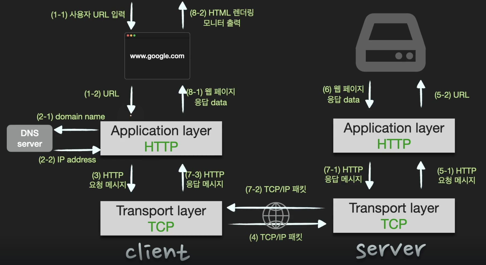

# www.google.com을 주소창에 쳤을 때 화면이 나오기까지의 과정

## 🍎 핵심 답변
- 사용자가 브라우저에 URL 입력
- 브라우저는 DNS를 통해 서버의 IP주소를 찾는다.
- client에서 HTTP request 메시지를 만들고, TCP/IP 패킷 생성 이후 server로 전송한다.
- server에서 HTTP request에 대한 HTTP response 메시지를 생성하고, TCP/IP 패킷을 생성하고 client로 전송한다.
- 도착한 HTTP response 메시지는 웹 브라우저에 의해 출력(렌더링)

## 🍎 그림으로 나타낸 과정

## 🍎 웹 동작 방식
- 유저가 브라우저에서 URL을 입력하면 응용 계층에서 URL을 DNS 서버에 보내 IP 주소를 받아온다.
- 이 IP 주소를 목표지로 설정한 HTTP request 메시지를 만들고 layer들을 순차적으로 내려가면서 캡슐화를 진행한 후 전송한다.
- 서버에 도착한 패킷은 역캡슐화를 진행하면서 응용계층까지 간 후 서버에 응답을 받고 HTTP response 메시지를 캡슐화한다.
- 클라이언트는 서버가 보낸 HTTP response 메시지를 역캡슐화 하고 메시지에 담긴 데이터를 토대로 웹브라우저에서 HTML 렌더링을 하여 모니터에 출력한다.
