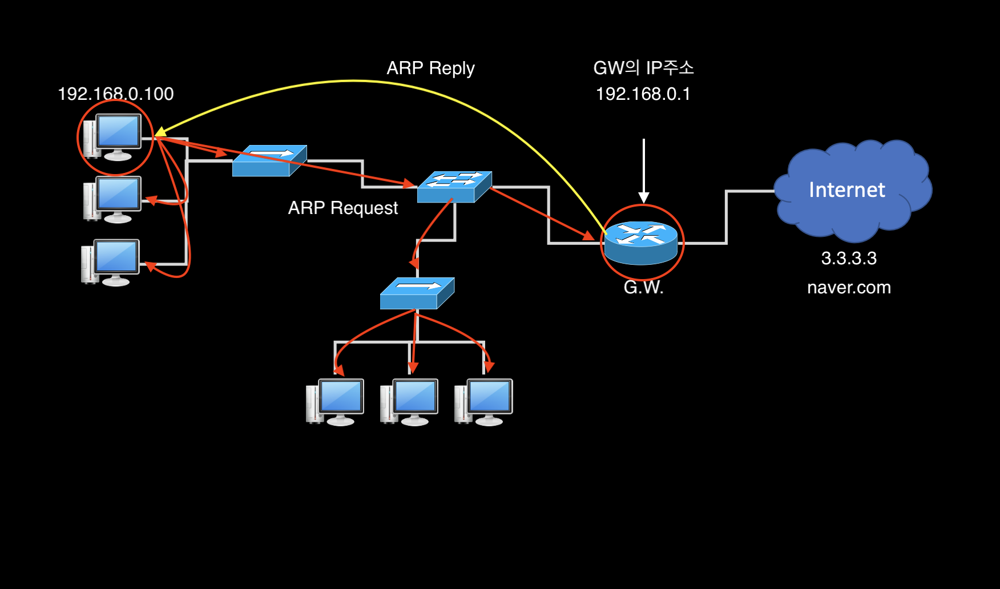

# ARP
- Address Resolution Protocol
- 여기서 Address라는 것은 IP(3계층) + MAC(2계층)

## 🍎 ARP는 언제 필요한 프로토콜일까?
- ARP는 IP주소로 MAC주소를 알아내려 할 때 활용된다.
- **보통의 경우 PC를 부팅하면 Gateway의 MAC주소를 찾아내기 위해 ARP Request가 발생하며 이에 대응하는 Reply로 MAC주소를 알 수 있다.**

## 🍎 그럼 Gateway의 MAC 주소는 왜 필요할까?
- 192.168.0.100의 주소를 가진 PC가 네이버를 접속하려 할 때, 반드시 Gateway의 MAC 주소를 알아야한다.
- 이때 DHCP와 비슷하게 브로드캐스트 방식으로 ARP Request가 발송된다.
- "우리 네트워크에서 192.168.0.1번의 주소를 가진 호스트가 있니?"라고 묻는것이다.
- 이때 192.168.0.1번의 주소를 가진 호스트를 제외하고는 응답을 하지 않는다.
- Gateway는 자신이 불렸으니 ARP reply를 한다.
    - "내가 192.168.0.1인데 내 MAC주소는 XXXXX(16진수)야~"라는 정보를 포함해서 192.168.0.100에 보낸다.
- 192.168.0.100의 PC가 naver.com와 통신할 때 패킷을 보내는데, 패킷안을 보자.
    - 사실 더 정확히는 Frame(L2)이다.
- 패킷의 목적지 MAC Address는 게이트웨이의 MAC 주소로 잡힌다.
    - 왜? 패킷의 MAC 주소는 일단 Gateway까지만 필요하다.
    - 라우터 이후에는 라우팅의 기준이 IP로 이루어 지기 때문에 MAC 주소는 Gateway까지만 유효하다.
- DHCP가 G.W의 MAC Address까지 알려주지 않는다. 그래서 G.W의 MAC 주소는 PC가 스스로 알아내야 하는데, 역시 broadcast 방식으로 G.W까지 도달해 G.W로 부터 MAC 주소를 알아낸다.

