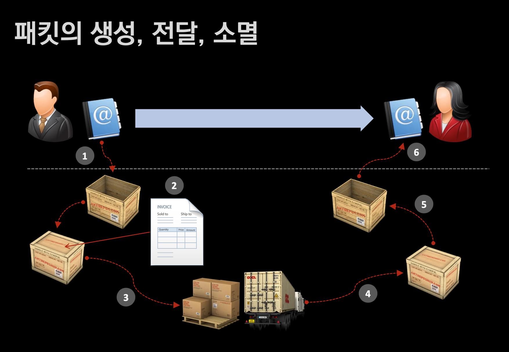

# Creation and Delivery of Packet
- 패킷의 생성과 전달에 대해 알아보자.

## 🍎 패킷의 생성 및 전달 순서
- 이미지에 매겨진 번호로 패킷의 생성과 전달에 대해 알아보자
- 하나의 프로세스에서 하나의 프로세스로 패킷을 전달하는 과정이다.
    - 1. 책(Data)을 준비한다. -> 패킷 생성 (캡슐화)
    - 2. 송장을 붙인다
        - 보내는 주소, 받는 주소을 적는다.(IPv4)
        - 보내는 사람, 받는 사람을 적는다.(Port 번호)
    - 3. 기사님께 택배를 전달한다 -> 패킷 전송
        - **기사님을 통해 택배가 오고 가므로 기사님을 게이트웨이라고 생각하면 된다.**
        - 기사님이 어디로 가시는지는 모른다.
        - 택배가 기사님께 넘어간 순간부터는 물류체계(라우팅)에 의해서 택배가 목적지 까지 이동한다.
    - 4. 택배가 집으로 도착한다.
        - 여기까지는 받는 사람의 주소(IPv4)를 보고 라우팅을 해서 집을 찾아왔다.
    - 5. 집에 온 택배를 받는 사람의 이름(Port 번호)로 분류한다.
    - 6. 받은 사람이 택배를 언박싱해서 책(Data)을 얻는다 (역캡슐화)

