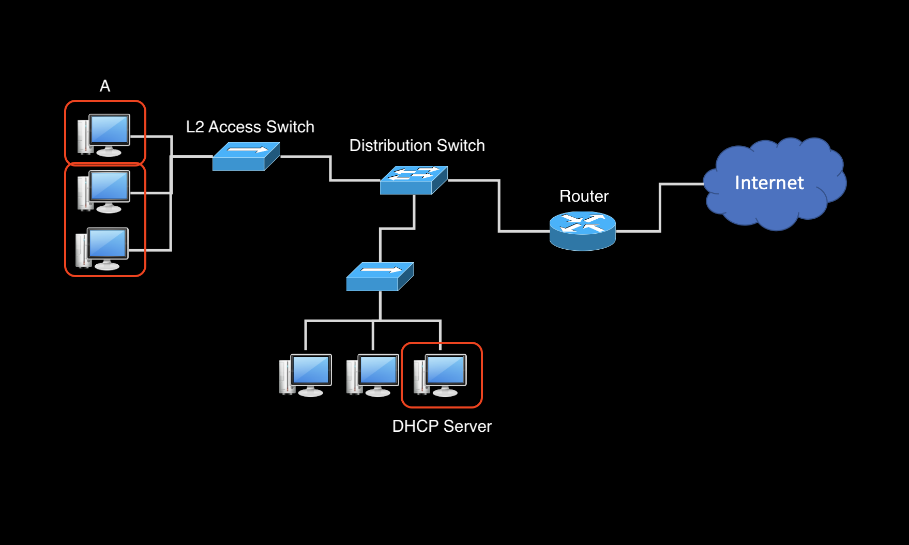

# DHCP
- DHCP는 왜 필요할까?
- ISP가 제공하는 인터넷을 사용하려면 IP주소, 서브넷마스크, GW 주소, DNS주소.. 를 설정해줘야한다. 이것을 자동으로 할당해주어 구성 정보를 효과적으로 관리하고, 네트워크의 유연성과 확장성을 향상시킨다.
- DHCP 체계는 주소를 할당하는 서버와 할당 받으려는 클라이언트로 구성
    - 서버가 나의 IP주소를 자동으로 할당해준다는 이야기!

## 🍎 DHCP 작동 방식
1. DHCP Discover 
- A라는 PC에 전원이 들어오면 그때 네트워크로 Broadcast Packet이 발송된다.
    - "우리 네트워크에 DHCP Server가 있니?"라는 **DHCP Discover 메세지 전송**
    - DHCP Discover 메세지가 L2 Access Switch에 도달하면 다른 PC들에게도 메세지를 발송한다.
2. DHCP Offer
- DHCP 서버는 DHCP Discover 메시지를 수신하면, 사용 가능한 IP 주소 중 하나를 할당하고 그 정보를 **DHCP Offer 메시지**에 실어 클라이언트에게 응답한다.
    - 자신이 DHCP 서버가 아닌 PC는 아무런 응답을 하지 않는다.
3. DHCP Request
- 클라이언트는 여러 DHCP Offer 중 하나를 선택하고 해당 서버에 대한 **DHCP Request 메시지를 전송**하여 선택한 IP 주소를 요청한다.
4. DHCP Acknowledge
- DHCP 서버는 클라이언트의 DHCP Request를 받으면, **해당 IP 주소를 할당하고 DHCP Ack 메시지**를 클라이언트에게 보냅니다.
- 클라이언트는 이를 수신하면 할당된 IP 주소 및 네트워크 구성 정보를 사용하여 자신의 네트워크 설정을 완료합니다.
5. IP 주소 갱신 
- 클라이언트는 할당받은 IP 주소를 사용하는 동안 주기적으로 DHCP 서버에게 IP 주소를 갱신하기 위한 요청을 보냅니다.
6. IP 주소 반납
- 클라이언트가 네트워크를 떠날 때 또는 IP 주소를 더 이상 사용하지 않을 때, 클라이언트는 DHCP Release 메시지를 사용하여 할당된 IP 주소를 반납합니다.

