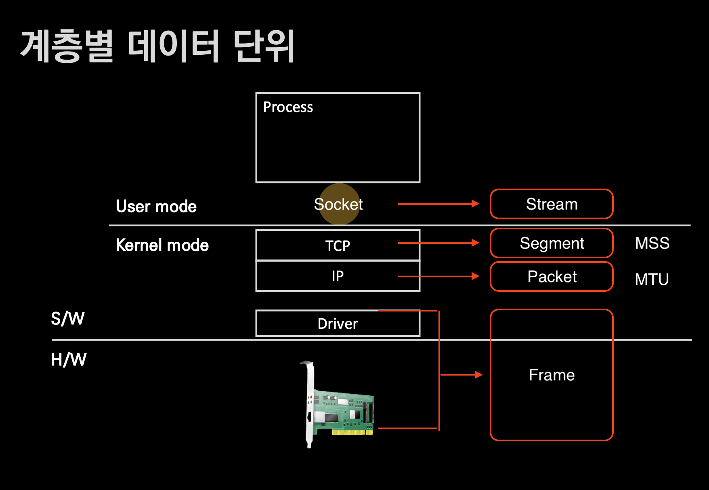

# Data Unit By Layer

## 🍎 계층별 데이터 단위
- L1 ~ L2 : Frame
- L3 : Packet
- L4 : Segment(TCP), Datagram(UDP)
- Socket Layer : Stream
    - Stream이란? -> 프로세스가 연속적으로 이어진 큰 데이터
    - Stream의 특징
        - 시작은 있지만 끝은 어플리케이션 프로세스가 정한다.

## 🍎 MTU
- Maximum Transmission Unit의 약자.
- MTU는 대부분 3계층 패킷을 기준으로 정한다. -> 패킷의 최대 크기라고 생각하면 된다.
- 일반적인 상황에서 최대 크기는 1500 바이트.

## 🍎 MSS
- Maximum Segment Size의 약자.
- 일반적인 상황에서 MSS의 최대 크키는 1460 바이트.
- MSS의 사이즈 산정은 어떻게 할까?

## 🍎 Stream이 4MB일때 이것을 다른 컴퓨터(프로세스)에게 어떻게 보낼까?
- 일반적인 상황에서 하나의 패킷이 담을 수 있는 최대 크기는 1500바이트다.
- 4MB 크기의 Stream를 다른 컴퓨터(프로세스)에게 보내려고 한다면 어떤 일이 일어날까?
    - Stream이라는 데이터를 패킷으로 보내기 위해 socket을 통해 전송 계층(TCP)으로 넘긴다.
    - 이때 Stream 데이터를 MSS의 크기인 1460 바이트에 맞게 분할한다 -> segmentation.
    - 아래 계층으로 내려가면서 header를 붙여 마지막엔 Frame 단위로 보낸다.

