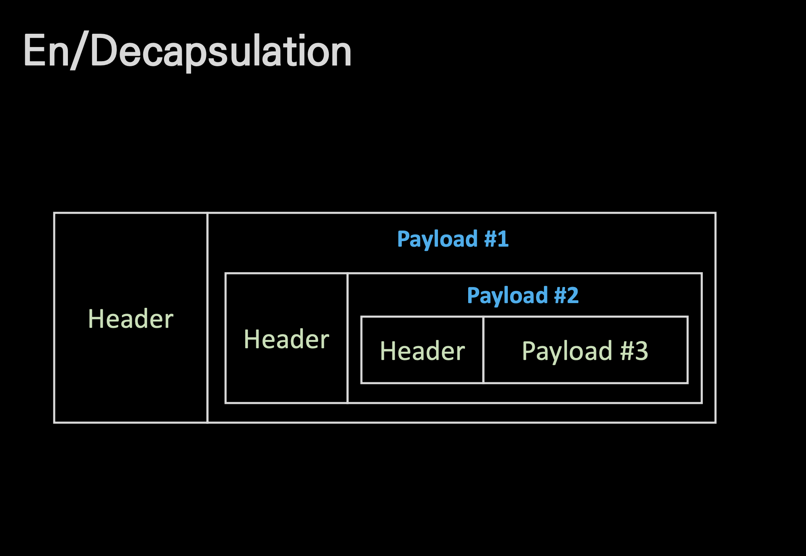

# Encapsulation Decapsulation

## 🍎 캡슐화 역캡슐화
- 러시아의 마트료시카 인형을 떠올리면 된다.
- 정보를 계층별로 문법에 맞게 감싸서 전송하고 수신하는 입장에서는 단계별로 감싸져 있는 내용을 풀면서 데이터를 전달하는것.

## 🍎 이미지 설명
- 가장 바깥의 Header와 Payload 1은 L2 layer의 frame이라고 하면, Payload 1 내부에 있는 Header와 Payload 2는 L3 layer의 packet이 된다.
- 다시, Payload 2 내부에 있는 Header와 Payload 3는 L4 layer의 segment가 된다.
- L5 layer 부터는 이러한 단위 데이터를 Stream 이라 부른다.
