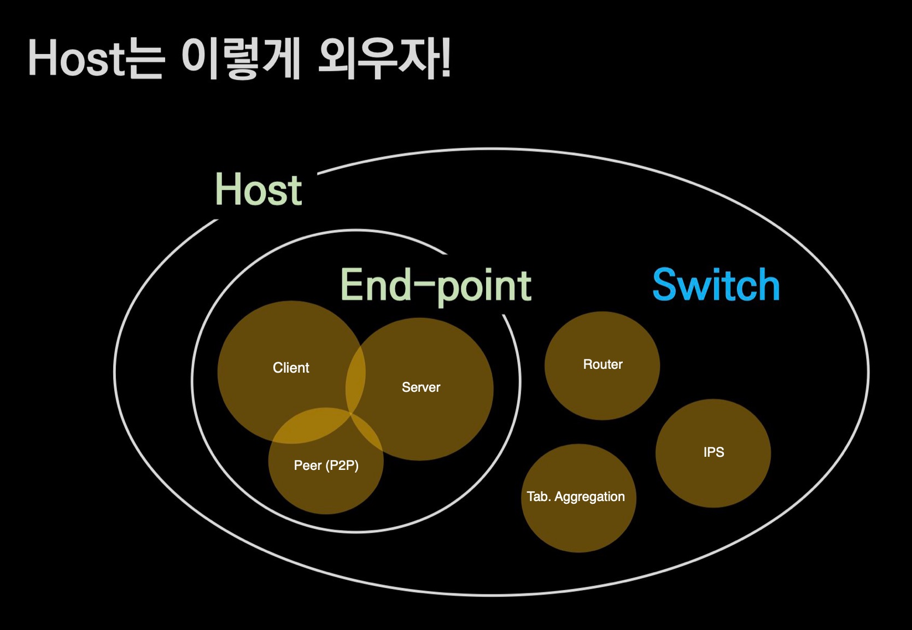

# Host

## 🍎 Host란?
- Host란?
    - 네트워크에 연결된 컴퓨터
- Host란 두가지로 나눌 수 있다.
    - Switch
    - End point

## 🍎 Switch란?
- Network 그 자체를 이루는 host
    - 네트워크 자체를 확장하거나 네트워크 자체의 기능 요소이면 switch.
    - 인프라 스트럭쳐라고도 불린다.
- L2 Switch는 host라고 하지 않는다.
- L3 Switch(Router)가 가장 대표적이다.

## 🍎 End point란?
- Switch(인프라 스트럭쳐)를 이용하는 이용 주체를 End point 또는 단말기 라고 한다.
- Server는 왜 End point일까?
    - 결국 switch를 이용하는 이용 주체이기 때문이다.
