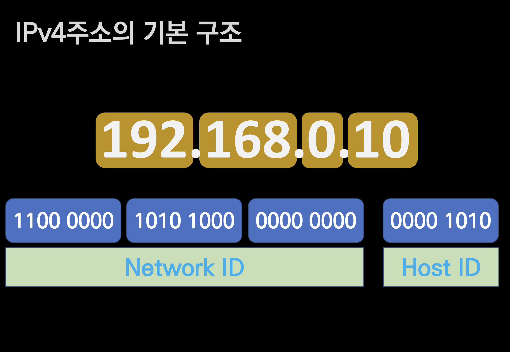

# IPv4

## 🍎 정의
- IPv4는 32bit로 표현되는 주소체계이다.
- IP는 Network ID, Host ID로 구분된다.
    - Host ID는 IP 프로토콜을 사용하는 인터넷 망에서 인터넷에 연결된 컴퓨터 한대를 식별하는 부여하는 고유번호
- Network ID
    - 서울시 강남구 역삼동
- Host ID
    - 113번지

## 🍎 택배 송장을 생각하면 쉽다!
- 결국 인터넷이라고 하는것은 IP주소를 이용해서 목적지를 식별해서 목적지에 가야하는것이다.
- 전체 IP 주소에서 Network ID는 역삼동까지 찾아갈 수 있도록 알려주는 대분류 주소이고, Host ID는 역삼동에서 몇번지 집으로 찾아가야 하는지 알려주는 소분류 주소이다.
- 그럼 이것은 위의 그림처럼 항상 24bit + 8bit로 이루어져 있을까?
    - 아니다! 이것을 결정하는것은 서브넷 마스크 주소이다.
###### tags: `NullNullDeveloper`

# IPv4

## 🍎 정의
- IPv4는 32bit로 표현되는 주소체계이다.
- IP는 Network ID, Host ID로 구분된다.
    - Host ID는 IP 프로토콜을 사용하는 인터넷 망에서 인터넷에 연결된 컴퓨터 한대를 식별하는 부여하는 고유번호
- Network ID
    - 서울시 강남구 역삼동
- Host ID
    - 113번지

## 🍎 택배 송장을 생각하면 쉽다!
- 결국 인터넷이라고 하는것은 IP주소를 이용해서 목적지를 식별해서 목적지에 가야하는것이다.
- 전체 IP 주소에서 Network ID는 역삼동까지 찾아갈 수 있도록 알려주는 대분류 주소이고, Host ID는 역삼동에서 몇번지 집으로 찾아가야 하는지 알려주는 소분류 주소이다.
- 그럼 이것은 위의 그림처럼 항상 24bit + 8bit로 이루어져 있을까?
    - 아니다! 이것을 결정하는것은 서브넷 마스크 주소이다.
