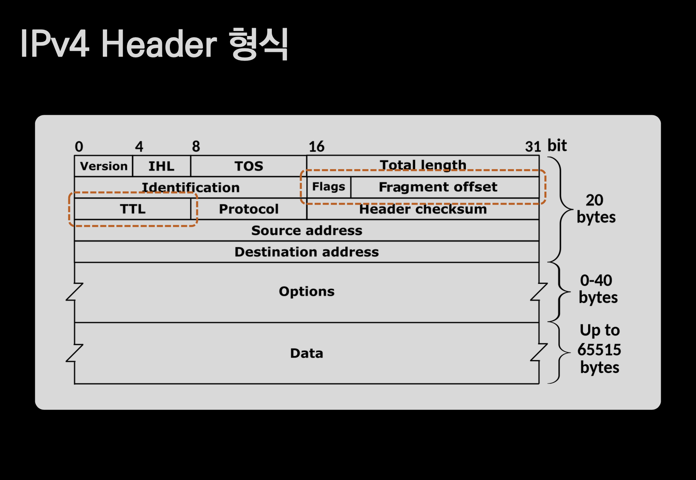

# IPv4 Structure

## 🍎 IPv4 Header 형식

### 📖 그림을 보기전 알아야할 정보
- 일반적인 패킷의 크기(MTU)는 1500바이트다.
- 패킷은 Header + Payload로 이뤄진다.

### 📖 IPv4 패킷 구성을 나타낸 그림에 대해서 알아보자!
- IPv4의 header 크기는 보통 20바이트 정도로 생각한다.
    - Options이 없는 경우!
- 1500에서 header의 크기인 20을 빼면 payload의 크기는 대략 1480정도로 생각할 수 있다.
    - 그림의 가장 아랫단에 위치한 Data 부분을 보면 "Up to 65515 bytes"라고 적혀있는데 보통은 MTU에 맞게 잘라져서 보낸다고 생각하면 된다.
- 그림의 가로축을 보면 0부터 31bit, 총 32bit라는것을 알 수 있다.
    - 작게는 4bit씩 끊어서 정보를 표기하는데, 2의 4승은 16이기 때문에 16진수로 알기 쉽게 표현한다.
- 가로 한 줄이 4 bytes라는것을 알 수 있고, header는 5줄로 이뤄져 있으므로 20 bytes이다.

### 📖 Header의 구성을 뜯어보자!
- 1행
    - version -> 현재 IP의 버전을 뜻한다.
        - 4 or 6
    - IHL(Internet Header Length) -> 헤더 길이를 나타낸다.
        - 왠만하면 5이다.
        - 그림에서도 나온것 처럼 5줄이다!
        - 또, 하나의 행이 4 bytes이고 헤더의 총 행의 숫자를 곱하면 header의 크기인 20 bytes가 나온다!
    - TOS(Type of Service) -> 서비스 품질과 관련된 정보를 나타난다.
    - Total length -> 전체 패킷 길이를 나타낸다.
        - 16비트로 표현하는데 2의 16승 -> 65536
- 2행
    - 2행에 나오는 모두 단편화와 관련이 있는 내용이다.
    - Identification -> 패킷을 식별하는데 사용되는 값
    - Flags + Fragment Offset -> 패킷의 조각화와 관련된 정보.
- 3행
    - TTL -> 패킷의 수명을 나타낸다.
    - Protocol -> 상위 계층 프로토콜을 나타낸다.
        - IP 패킷의 payload 부분에 포함되어 있는 상위 계층의 프로토콜을 가리키는 값.
        - IP 계층의 윗 계층이니 전송계층의 TCP, UDP, Etc를 나타내는 값.
        - 프로토콜마다 고유의 번호가 있다.
    - Header Checksum -> 헤더의 오류 검사를 위한 합.
        - 패킷이 송수신되는 과정에서 손상이 일어났는지를 확인하는 값.
- 4행, 5행
    - Source Address -> 송신자의 IP 주소 (32bit)
    - Destination Address -> 수신자의 IP 주소 (32bit)
