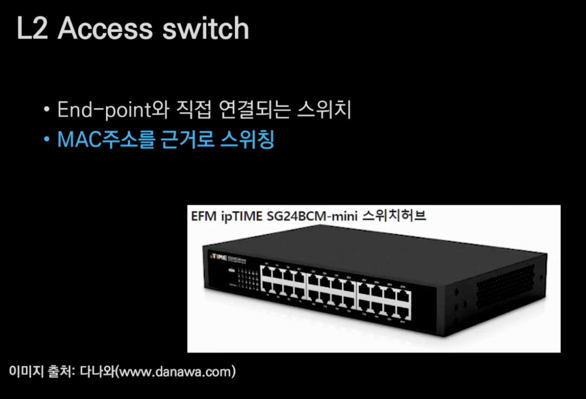

# L2 Access Switch
## 🍎 개념
- End-point와 직접 연결되는 스위치
    - L2 스위치라고 부르지 않고 L2 Access 스위치라고 부른다.
    - OSI 7계층을 DoD의 기준으로 4계층으로 나눈 모델을 보면 아래와 같은 형식이다.
        - Application Layer
        - Transport Layer(Host to Host)
        - Internet Layer
        - Network Access Layer
- L2 계층이니 MAC 주소를 근거로 스위칭.

## 🍎 사진 설명
- 사진에 나와있는 24개의 구멍을 포트라고 한다.
- 즉, 이 스위치허브는 24포트 허브라고 말할 수 있다.

