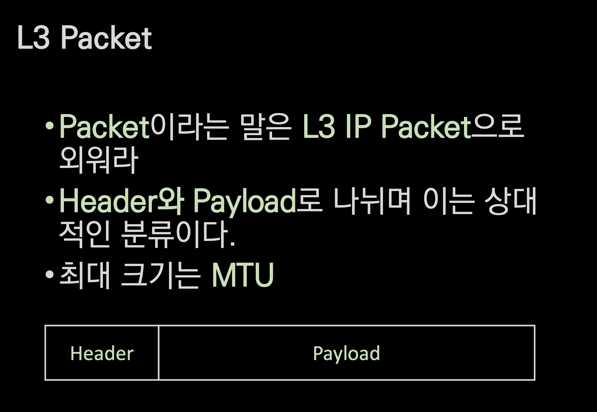

# L3 IP Packet

## 🍎 Packet의 정의
- L2의 frame처럼 단위 데이터.
- Packet이라고 하면 IP Packet을 생각하면 된다.
- Header와 Payload로 구성되어있다.
    - Header에는 Src의 IP와 Dst의 IP를 담고 있다. 
- 최대 크기는 MTU
    - Maximum Transmission Unit
    - 특별한 이유가 없다면 패킷의 MTU는 1500 바이트다(매우작음)
        - 이정도 사이즈로 전송할 수 있는 데이터는 많지 않다.
