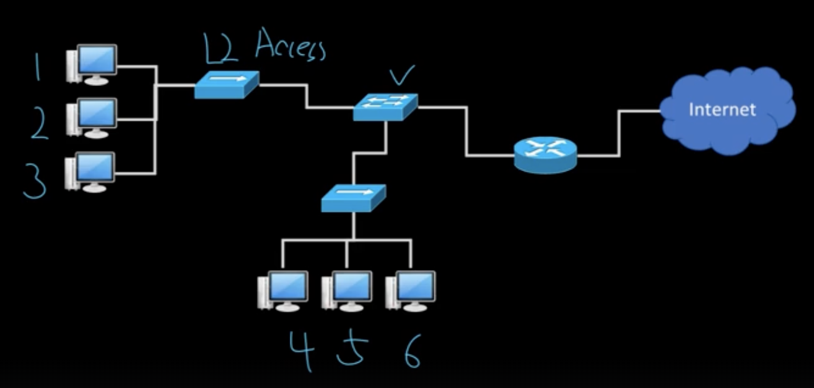

# LAN, WAN, Broadcast
## 🍎 정의
- Broadcast 주소라는 매우 특별한 주소가 존재한다.(MAC, IP 모두 존재)
    - MAC주소에서 Broadcast는 이진수로 봤을때 전부 1로 되어있으면 그것이 브로드캐스트 주소다.
    - MAC address는 48bit이다.
    - 즉, MAC 주소의 48비트 전부 1로 채워진 FF-FF-FF-FF-FF-FF이 브로드캐스트 주소가 되는것이다.
    - 1111 1111 1111 1111 ... 1111 1111
- **Broadcast는 효율을 떨어뜨린다.**
    - 예를들어 아파트에 사는데 관리실에서 아파트 전체에 방송을 한다면 도움이 되는 정보를 준다고 방송을 하지만 경우에 따라서 내가 만약 회의중이였다면 그 방송을 나에게는 시끄러운 방송일 뿐이다.
    - **방송(브로드캐스트 통신)이 시작되면 그 아파트에 사는 사람들은 방송을 듣느라 모든 행동을 잠시 멈춰야 한다.**
    - 그래서 꼭 필요할때만 써야하는 제한적인 통신방법이다.
    - **브로드 캐스트 범위를 최소화 시키는것이 중요**하다.
- 통신은 출발 주소와 목적지 주소가 있다.
    - **여기서 목적지 주소가 브로드캐스트 주소(모든 비트가 전부 1로 채워진)라면 전부 다 받으라는 이야기이다.**

## 🍎 그림으로 이해하는 브로드캐스트

- LAN 네트워크 환경에서 1번 컴퓨터가 브로드캐스트 통신을 하게 되면 2,3,4,5,6번의 컴퓨터에게 통신을 시도한다.
    - 브로드캐스팅은 "여기 누구누구 있어? 있으면 대답해~"라는 식의 통신
    - 이때 브로드캐스트 통신이 끝날때까지 다른 컴퓨터들은 통신을 할 수 없다.
    - **이것이 위에서 이야기 했던것처럼, 브로드 캐스트가 네트워크 전체의 효율을 떨어뜨린다는 이야기. 그래서 브로드캐스트 되는 범위를 최소화 해야하는것.**
- LAN에서 보내는 데이터의 단위는 Frame이라고 배웠다.
    - 이 프레임 안에는 또 헤더와 데이터로 나뉘고, 헤더 안에는 보내는 주소, 받는 주소 총 2개가 있다.
- 브로드캐스트의 범위를 줄여줌으로써 네트워크의 운영 효율을 늘릴수도 있다.
- 하지만, 브로트캐스트가 필요한 곳도 있는데 범위 제한으로 통신을 받지 못할 수도 있으니 많은 고려가 필요하다.
