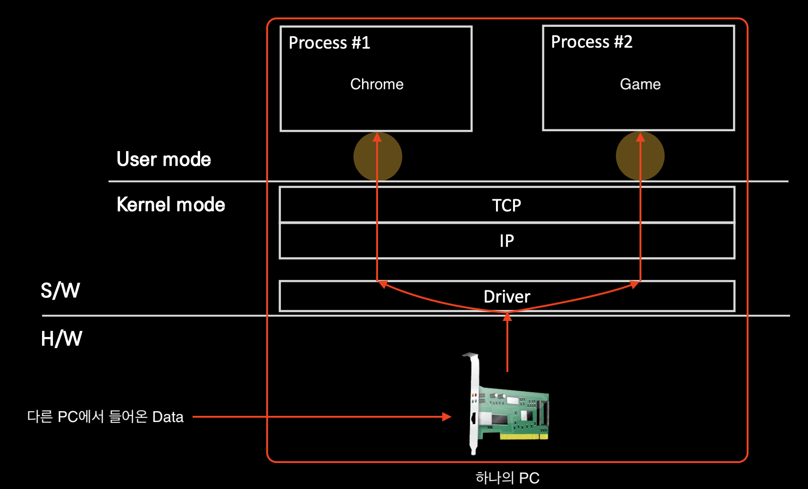
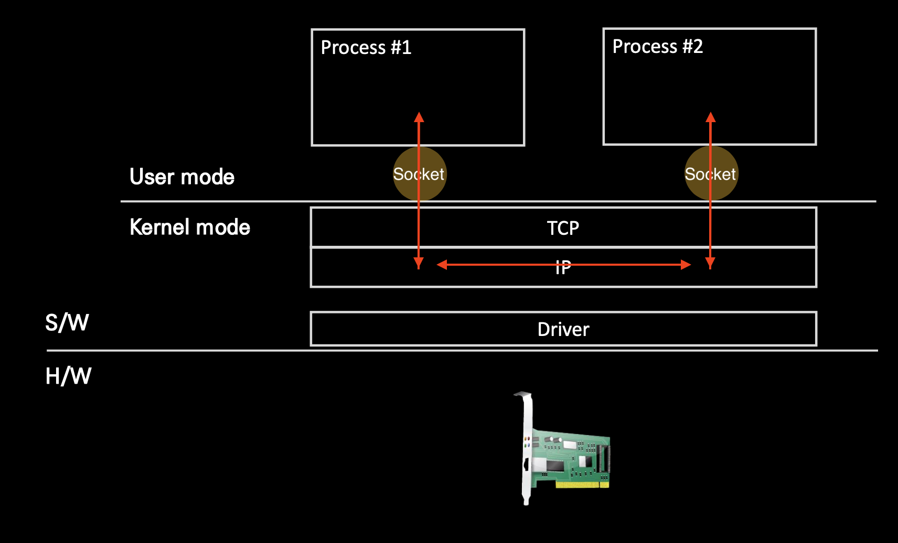

# Loop Back Address
- Host 자신을 가리키는 IP 주소를 의미한다.

## 🍎 네트워크 통신을 하는 주체는 프로세스.
- 인터넷을 사용하는것은 컴퓨터에서 실행중인 프로세스이다.
- 작업관리자를 띄워보면 여러 프로세스가 돌아가고 있는것을 알 수 있다.
- 보통은 다른 프로세스들과 통신을 하지만 나(자신)의 프로세스와 통신을 해야할 때가 있다.
- 즉, 내가 나에게 연결 or 접속 해야하는 경우 Loop Back Address를 사용한다.
- 이때 127.0.0.1을 사용한다.
- 127.0.0.1 부터 127.0.0.254)까지 사용가능하지만 보통은 127.0.0.1을 사용한다.

## 🍎 일반적으로 하나의 PC가 다른 PC와 통신할 때.
- 아래의 그림에서 보듯이 다른 PC로 부터 정보를 받을때는 패킷을 통해 받는다.
- 캡슐화 되어있는 패킷을 L2 계층에서 부터 역 캡슐화하며 데이터를 얻는 작업을 통해 통신한다.

## 🍎 동일 PC내 프로세스간 통신을 할 때.
- 내 PC안에 두가지 프로세스가 서로 정보를 주거니 받거니 하기 때문에 L2 계층까지 내려가지 않고 Loop-Back IP를 이용한 소켓 통신한다.

## 🍎 용어 참고.
- 소켓
    - 커널 요소를 추상화한 file을 소켓이라 부른다.
    - 보통 TCP 소켓을 말하는데, 이는 TCP 프로토콜을 user mode application이 접근 할 수 있도록 file 형태로 추상화한 interface.
