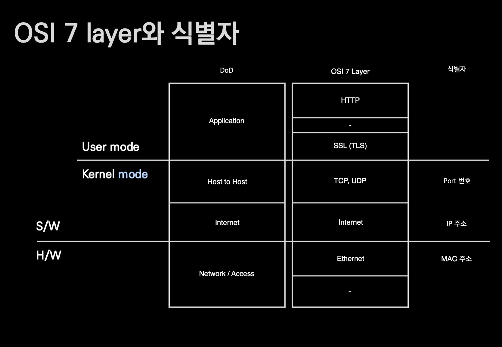

# OSI 7 Layer And Identifier

## 🍎 OSI 7 계층과 식별자에 대한 설명
- 식별자는 대상을 식별하는 "이름"이다.
- L2 (Data Link) 계층의 식별자는 MAC 주소이다.
    - 즉, LAN 카드의 식별자이다.
    - 주민등록번호는 사람한테, MAC Address는 LAN 카드에 붙는다.
    - 만약, 컴퓨터에 LAN 카드가 3개 꽂혀있다면, MAC Address도 3개!
- L3 (Network) 계층의 식별자는 여러가지가 있지만 제일 많이 쓰이는것은 IP 프로토콜이고, IP 프로토콜에서 제일 중요한것은 IP Address이다.
    - v4와 v6가 있는데 이 수업에서는 v4만 다룬다.
    - 그럼 IP 주소는 누구에게 붙나?
    - 인터넷을 사용하는 컴퓨터(Host)에 붙는다.
- L4 (Transport) 계층의 식별자는 Port번호이다.
    - 하지만 Port 번호는 관점에 따라 달라지는데, 크게 3가지로 나뉜다.
    - 선을 직접 깔고 배선 공사하시는 분들(L2) 계층의 직업을 가지신 분들에게 Port번호를 말하면 "공유기의 단자"를 생각하신다.
    - Network 관리하시는 분들은 Port 번호를 "웹 서비스"를 생각하신다. 웹 서비스가 작동하려면 해당 웹서비스가 쓰는 Port를 개방해야하기 때문이다.
    - 프로그램을 관리하거나 개발하시는 분들에게 Port는 Process를 떠올리게 한다.
        - 작업관리자의 port번호인듯하다.

## 🍎 DoD 그림 설명
- 미 국방부에서는 OSI 7 계층을 4개로 분류한다.
    - 가장 밑단 부터
    - Network / Access
    - Internet
    - Host to Host
    - Application
