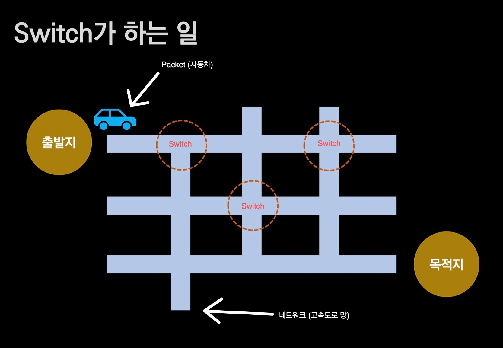

# Switch

## 🍎 Switch란?
- 위의 이미지에서..
    - 여러갈래의 길로 나뉘어져 있는것을 Network
    - 자동차를 Packet
    - 교차로를 Switch 라고 생각하면 된다.

## 🍎 Packet의 경로 선택 기준 (중요)
- 자동차(Packet)가 교차로(Switch)에서 무엇을 기준으로 경로를 선택할까?
- 일반적으로 여러 선택지에서 무언가를 택하는것에는 기준(근거)가 있어야한다.
- 패킷도 마찬가지로 근거에 따라 경로를 선택한다.
    - 패킷이 경로를 선택하는 행동을 Switching이라 한다.
- 만약 인터넷이라는 도로망(network)이 있고 거기서 패킷이 IP 주소를 근거로 Switching을 했다면, IP주소는 L3(Network 계층)에 속하니, 이것을 L3 Switching이라고 한다.
    - L3 계층 한정으로, 교차로(switch)를 Router라고 부른다.
    - 이때, 자동차가 경로를 선택하는 근거는 Routing Table이 된다.

## 🍎 근거에 따라 달라지는 스위칭 이름
- MAC 주소를 통해 switching을 한다 -> L2 스위칭
- 포트번호를 통해 switching한다 -> L4 스위칭
- HTTP을 통해 switching한다 -> L7 스위칭

## 🍎 패킷이 목적지까지 가기 위해서 고민해야 할 주제
- 비용 -> Matric 값이라고도 한다.
- 보통은 패킷(자동차)가 교차로(switch)에서 더 적은 비용을 소비하는 곳으로 경로를 선택한다.
