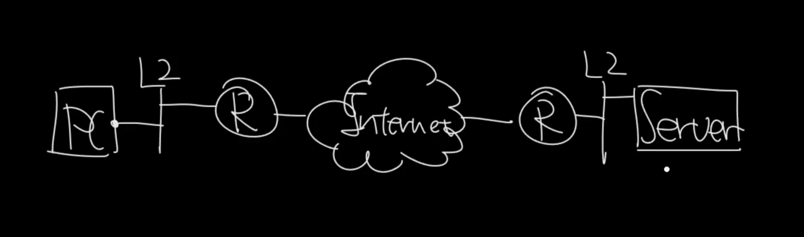
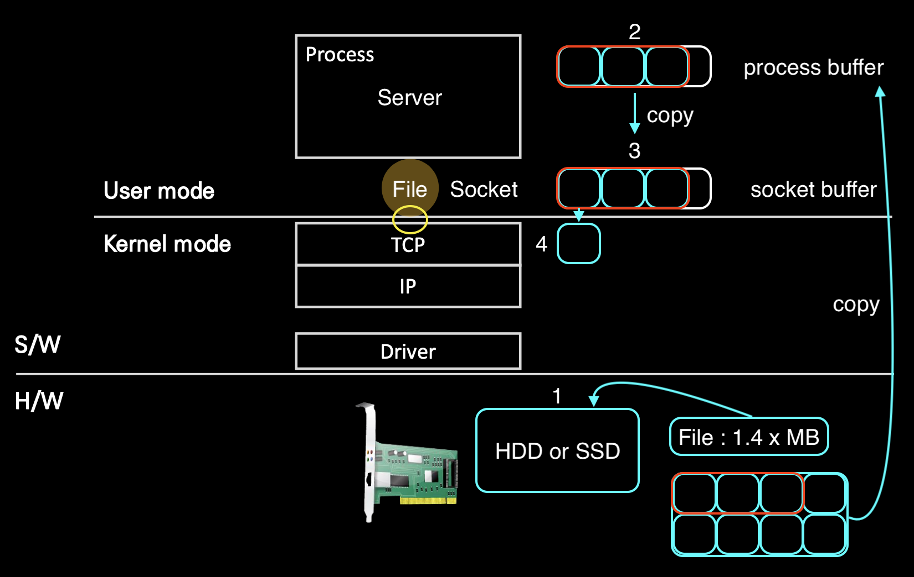
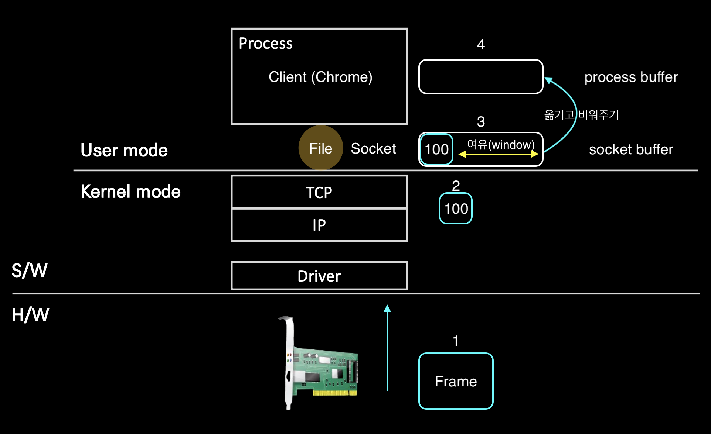

# TCP / IP Structure
- TCP/IP 송수신 구조를 알아보자.

## 🍎 파리에서 에펠탑을 서울로 보내려면 어떻게 해야 할까?
- 에펠탑(보내려는 주체)을 박스(Packet)의 크기(MTU)만큼 분해
- 운송
- 택배를 받으면서 조립

## 🍎 컴퓨터와 컴퓨터가 어떻게 통신하는지 대략적으로 알아보자.
- PC에서 보낸 패킷이 L2 Access Switch를 타고 Router를 거쳐 인터넷을 통해 목적지의 Router를 거쳐 L2 Access Switch를 타고 목적지에 도달하게 된다.

## 🍎 서버에서 클라이언트에 데이터를 보내는 과정을 알아보자.
1. 서버가 클라이언트에 보낼 자료가 있는 HDD 또는 SSD이다.
    - 예를 들어 클라이언트에 보낼 파일의 크기가 1.4MB라고 하자.
    - 그 아래 그림은 파일을 형상화한 모델.
2. 프로세스는 HDD에 있는 파일을 process buffer의 크기만큼 일부 가져온다.
    - process buffer의 크기는 누가 정할까? → 프로그램을 개발한 사람이 정할 수 있다. 
        - (해당 프로그램 개발자가 한번에 1.4 MB을 모두 가져올 것인지 아니면 일부를 가져올 것인지 정할수 있다는 이야기)
    - 이미지에서는 8개중 3개(일부)를 가져왔다. 더 정확히는 HDD내 파일의 일부(3개)를 process buffer로 Copy한것이다.
    - 이후, process가 현재 process buffer에 있는 데이터를 send하겠다고 하면 다시 socket buffer로 copy 한다.   
3. 중요! 그림에서는 1번에서 2번으로 넘어가는 시점을 봤을때 File에서 데이터를 가져올 때부터 데이터를 잘라서 가져온것처럼 보이지만, 쪼개서 가져온것이 아니라 일부를 통째로 가져온것이고 실제로 데이터를 패킷 형태로 보내기위해 분할하는 구간은 L4 layer로 넘어가는 노란 동그라미 부분이다.
    - 이 작업을 Segmentation이라고 한다.
5. Segmentation 이후 분할된 segment에 header를 붙여가면서 캡슐화를 진행하고 전송한다. TCP의 경우에는 순서를 보장해야하므로 segment에 번호를 붙여 순서를 지키면서 전송한다.

## 🍎 클라이언트가 서버에서 데이터를 받는 과정을 알아보자.
1. 서버가 보낸 패킷이 클라이언트에 도착했다.
    - 패킷이라고 했지만 정확히는 Frame이 도착한 것이다.
    - Frame이 패킷을 감싸고 있는 형태.
2. 서버가 보낸 상자를 역캡슐화를 진행하면서 L3 계층에서 A라는 패킷을 얻었다.
3. 이제 100번 패킷을 L5 계층인 Socket으로 올리면서 socket buffer라는 곳에 넣어준다.
    - **이때 socket buffer에 비어있는 여유공간을 window라고 한다!**
    - socket buffer가 채워지면 여유공간은 줄어든다.
4. 클라이언트의 프로세스는 통신을 통해 들어온 socket buffer가 다 채워지면 socket buffer에 있는 데이터를 process buffer로 옮긴다.
    - 이때, process buffer와 socket buffer 사이에 속도 차이가 발생하는데, socket은 서버로 부터 전달 받은 데이터를 socket buffer에 채우기 바쁘고, process buffer는 socket buffer에 있는 데이터를 가져오고 비우기 바쁘다.
    - **이러한 과정은 socket buffer에 여유공간을 계속 만들어주기 위함이다.**
    - 즉, 누군가는 퍼내고 누군가는 채우는 작업은 마치 톱니바퀴가 도는듯이 동시에 일어난다.

## 🍎 TCP 프로토콜을 사용한 통신이니 순서가 보장되어야 한다.
- TCP는 연결지향 프로토콜(Connection Oriented)이다.
- 100번 패킷이 도착했다면 TCP는 "100번 패킷은 잘 받았어~"라고 서버에게 피드백을 주는데 ACK # 101이라는 피드백을 준다.
    - 이 뜻은 100번은 잘 받았으니 다음 번호인 101번 패킷을 달라는 이야기다.
    - 이것이 3-way handshake에서 자주 언급되는 ACK(acknowledge) 피드백이다.
- 잠깐! 서버는 클라이언트에게 패킷을 보내고 잠시 기다리는 경우가 있다. 이는 클라이언트가 패킷을 잘 받았는지 기다리는 경우다. 예를들면 100번 패킷을 보내고 클라이언트가 보낼 ACK # 101을 기다린다.
    - 클라이언트가 100번 패킷을 잘 받았다면 서버에게 다음 패킷인 101번을 보내달라고 할것이기 때문이다.
    - **이때, ACK 신호를 보내면서 현재 socket buffer의 여유 공간도 함께 보낸다.**
    - 이는 "내(클라이언트)가 얼마나 받을 수 있는지 서버에게 알려주기 위함" 이다.
    - 서버는 클라이언트가 보낸 (ACK 신호 + 여유공간)을 보고 여유공간이 있으면 패킷을 더 보내고, 여유공간이 없다면 보내는것을 중단한다.

## 🍎 네트워크는 생각보다 불안정하다.
1. Loss(유실) - Network 문제
    - 보통 H/W 구간에서 발생한다.
    - 패킷이 오다가 유실된다. 어디서 유실되는지는 모른다!
2. TCP / IP 통신은 정교한 타이머를 통해 작동되는데 서버와 클라이언트의 합이 안맞는 경우 - Network 또는 End Point 문제
    - TCP Re-transmission이라 한다.
    - TCP는 송신에 대한 응답이 오지않는 경우 일정시간을 대기 후에 다시 재전송을 한다.
    - 송신자는 패킷을 송신하고 나면 별도로 정의된 Timer를 시작한다. 그리고 Timer의 시간이 만료되면 다시 패킷을 전송한다. 기본적인 재전송 과정이다.
    - 간발의 차로 서버에서 클라이언트에게 이미 클라이언트가 받은 패킷을 다시 보낸다.
    - 클라이언트가 받은것을 또 받고 그에 대한 ACK 신호를 보내면 ACK 신호의 중복이므로 이 현상을 ACK Duplicate라고 한다.
3. 오는 순서가 잘못된 경우 - Network 문제
    - Out of Order라고 한다.
    - 1 -> 2 -> 3 -> 4 순서로 와야하는데 1 -> 2 -> 4 -> 3 순서로 오게된다면 수신하는 쪽에선 순서대로 오지 않은 경우.
    - **이 경우는 운영체제 수준에서 보정을 한다.**
4. Zero-Window - End Point 문제
    - 여유공간을 크기를 Window-size라고 한다. 네트워크는 문제 없이 socket buffer를 채우는데, 프로세스가 이 속도를 따라가지 못해 socket buffer를 비워내지 못했을때.
    - 즉, 네트워크의 송수신 속도가 process buffer보다 빠른 경우에는 송신자가 데이터를 보내도 수신자가 받을 방법이 없기 때문에 발생하는 문제.
    - 이 경우, 프로세스의 CPU 점유율이 100% 이거나 다른 이유로 process buffer를 비울수 없는 상황이기 때문에 해당 프로그램을 확인해야한다.
