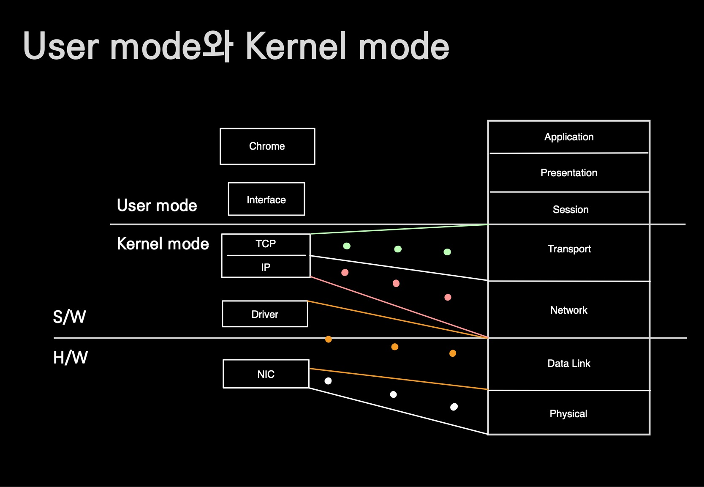

# User mode와 Kernel mode

## 🍎 그림에 대한 전반적 설명
- 컴퓨터는 SW, HW로 나뉘고, SW는 다시 User mode application과 Kernel mode software로 나뉜다.

### 📖 NIC와 Driver
- 앞으로 자주 등장할 NIC(Network Interface Card)는 우리가 흔히 말하는 LAN 카드다.
- 하드웨어를 제어하기 위한 software를 Driver라고 부르는데, 하드웨어는 드라이버가 설치되어 있어야 작동 가능하다.

### 📖 Application(Chrome)이 커널의 구성요소에 접근하는 방법
- 커널에는 통신을 위한 프로토콜(규칙)이 구현된 소프트웨어가 있다.
    - TCP
    - IP
- user mode의 application이 커널의 구성 요소(TCP/IP)를 접근할 수 있도록 커널에서 길을 열어주는데 그것이 Interface다.
    - kernel은 신 처럼 모든것에 대한 접근, 제어가 가능하고 user는 인간처럼 일부만 가능하다.
    - 인간(어플리케이션)이 신(커널모드의 TCP/IP)에게 기도(메세지 전달)하는것은 신이 열어둔 Interface를 통해서 전달이 가능하다.

### 📖 Interface (Socket)
- Interface의 형태는 File로 되어있다.
    - 특별하게 TCP/IP를 추상화 시킨 Interface File은 Socket이라고 부른다.
    - 즉, 소켓도 File.

### 📖 User mode와 Kernel mode를 무엇을 기준으로 나눌까?
- 위의 그림에서 우측에 7개의 요소가 계층적 구조를 띄고 있는 것을 OSI 7 Layer라고 한다.
- L1인 Physical부터 L7인 Application으로 나눠지는데 **L5인 Session Layer부터 User mode application이라 할 수 있다**.
    - **Process 수준으로 설명이 된다.**

### 📖 어느 계층에 무엇이 있는지 알아보자
- 전송계층(Transport Layer)과 네트워크계층(Network Layer)는 운영체제(Kernel)에 구현 되어있다.
    - 그림에도 나와 있듯이 TCP는 Transport Layer(L4). IP는 Network Layer(L3)이다.
- 하드웨어를 제어하는 소프트웨어인 Driver는 Data Link 계층에 있는데 Data Link 계층은 다른 계층들과는 조금 다르게 SW와 HW의 중간다리 역할을 한다.
    - 다른 계층은 SW면 SW. HW면 HW이지만 위의 그림에서도 볼 수 있듯이 Data Link 계층은 SW인 Driver와 HW인 NIC에 살짝 걸쳐져 있다.
